# Empyrion Web Access

## Was ist das?
Empyrion Web Access ist eine MOD die den Zugriff auf das Spiel als Admin über einen Webbrowser ermöglicht.
Dadurch das die MOD ohne Oberfläche oder Remotedesktop auf dem Server auskommt ist sie auch für den Einsatz bei Gamehoster geeignet.
Sie startet und beendet sich automatisch mit dem Spiel und kann von beliebig vielen Admins gleichzeitig genutzt werden.

Empyrion Web Access ist frei zur nicht kommerziellen Benutzung.<br>
Über eine Aufmerksamkeit würde ich mich aber freuen https://paypal.me/ASTICTC

Viel Spaß beim Spielen und dem Serverbetrieb wünscht<br>
ASTIC/TC

# Installation
* Den Inhalt der ZIP Datei in das Verzeichnis "\\Empyrion-Dedicated Server\\Content\\Mods" entpacken.

* Wenn Ihr den Empyrion-Dedicated Server startet, wird im Savegameverzeichnis 
"\\Saves\\Games\"\[Savegame\]\"\Mods\\EWA" die Datei "xstart.txt" erstellt. Wobei "Savegame" euer Spiel-Savegame-Name ist.

* Den Server wieder herunterfahren und die "xstart.txt" in "start.txt" umbenennen. Wenn der Server wieder gestartet wird, sollte der EWA-Loader einsatzbereit sein.


* !!! WICHTIG !!!
EmpyrionWebAccess startet nicht automatisch. Es muss immer die "start.txt" Datei im Verzeichnis \[Savegame\]\\MODs\\EWA liegen. 
* Wollt Ihr den EWA wieder abschalten reicht es die "start.txt" wieder in "xstart.txt. umzubennen. 
 

# WebServer Konfiguration
Standardmäßig ist der EWA unter https://\[Rechnername\] zu erreichen.

Soll dies auf einem anderen Port oder Url geschehen muss die Textdatei "appsettings.json" im
Savegameverzeichnis unter \[Savegame\]\\MODs\\EWA konfiguriert werden.
Es werden mehrere ServerURL VORGESCHLAGEN - unter Http und HttpsDefaultCert darf jeweils nur ein Eintrag "Url" unkommentiert stehen bleiben die 
anderen MÜSSEN per // auskommentiert sein werden.

Hinweis: Der Webserver läuft ausschließlich über HTTPS und nutzt das HTTP nur zur Weiterleitung auf HTTPS.

## Erstes Login
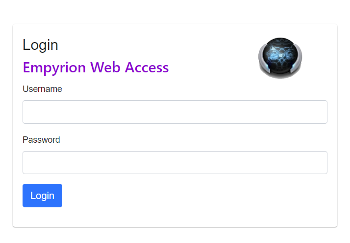

Wenn man nun den EGS-Server startet sollte Empyrion Web Access unter der ausgewählten ServerURL eine Anmeldemaske anzeigen.

Als erster Benutzer wird hier das Kürzel und Kennwort automatisch in der Benutzerdatenbank hinterlegt und akzeptiert. Gebt einen Benutzernamen und ein Kennwort ein und Ihr habt Zugriff. Alle Benutzer können nun über die Oberfläche angelegt, geändert oder gelöscht werden.

Hinweis: Da das HTTPS Zertifikat des EWA selbst signiert ist, zeigt der Browser eine Warnung an das die Verbindung nicht sicher sein. Diese kann hier ignoriert werden.

## Das Hauptfenster
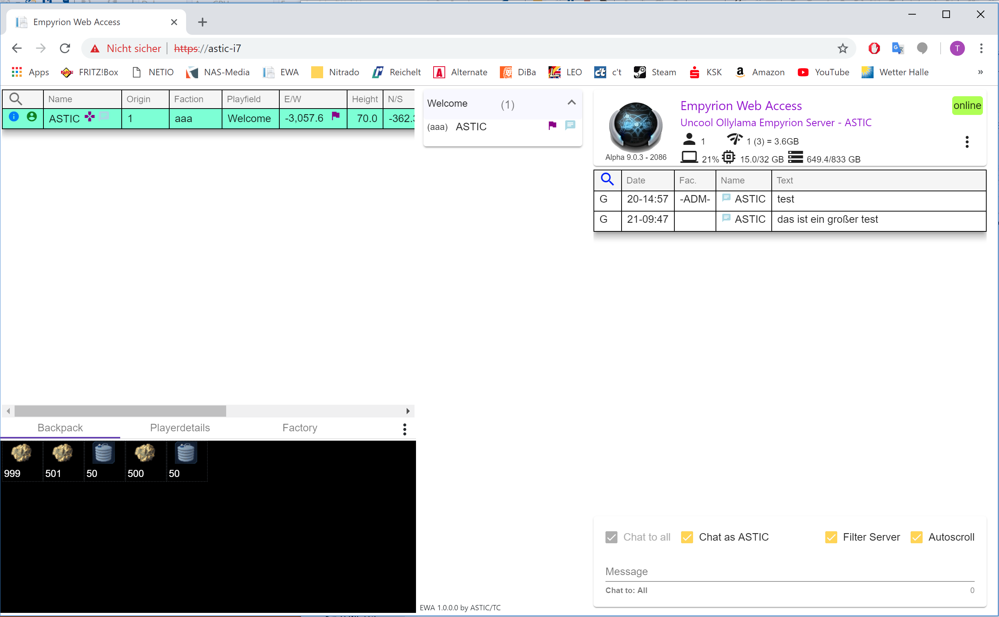

### System-/Spielinformation
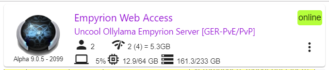

Rechts oben werden Informationen zum Server (CPU, RAM, HDD), dem Spiel (Spieler online, Anzahl der Playfieldserver, der Reserveserver und deren Speicherverbrauch) und der Version angezeigt.
Auch befindet sich hier unter den drei senkrechten Punkten das Menü zu weiteren Fenstern und zum Logout.

### Chatbereich
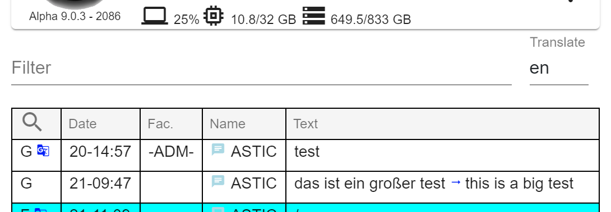

Hier laufen alle Chatmeldungen des Spiels ein. Der Admin kann von hier ebenfalls Chatmeldungen in das Spiel absetzen in dem er den Text im "Message" Eingabefeld eingibt und mit Enter/Return bestätigt. Wenn der Haken "Chat as NNNN" gesetzt ist wird dabei automatisch für die Spieler im Spiel ein NNNN: vor die Chatmeldung gesetzt.

Um mit einem Spieler direkt zu Chatten kann dieser mit dem Chatsymbol ausgewählt werden. Sein name wird dann unter dem Eingabefeld angezeigt. Um wieder mit allen Spieler chatten zu können kann dann einfach der Haken bei "Chat to all" wieder gesetzt werden.

Eine Übersetzung des Chats kann mit dem Feld Translate eingestellt werden. Danach können die gewünschten Meldungen über die Übersetzungsicons zur Übersetzung angefordert werden

Wenn ein Chattext (direkt oder per Timetable) mit | beginnt wird er als übersetungsfähiger Text aus der Localization.csv gewertet. Dieser Kann noch mit bis zu zwei Parametern welche ebenfalls mit | getrennt werden modifiziert werden.
z.B. |ChatTest|abc|42
und einem Eintrag in der Localization.csv
ChatTest,"English text {0} {1}","Deutscher Text {0} {1}"

ergibt für die Sprache Englisch: Engish text abc 42
und für Deutsch: Deutscher Text abc 42

### Aktive Playfields und die Spieler welche sich darin aufhalten
Hier werden die aktiven Playfields mit ihrem Namen und der Anzahl Spieler aufgelistet.
Die Spieler werden mit Fraktion und Namen angezeigt.

Das Chatsymbol dient dazu mit dem Spieler direkten Kontakt aufzunehmen und das Fahnensymbol, dessen aktuelle Position zu speichern (s. Warp).

### Die Liste der bekannten Spieler
Hier werden alle Spieler angezeigt die seid in der Laufzeit von EWA mal online waren und deren PLY Datei sich noch im Savegame befindet.

Der Spieler wird hier mit seinem Onlinestatus, Namen, Fraktion, Herkunft ... angezeigt.
* Das Chatsymbol dient dazu mit dem Spieler direkten Kontakt aufzunehmen und das Fahnensymbol, dessen aktuelle Position zu speichern (s. Warp).
* Das Warpsymbol (Gamepadsymbol) dient dazu das Warpfenster für den Spieler aufzurufen, mit dem die Position des Spielers im Spiel verändert werden kann.

### Inventaranzeige
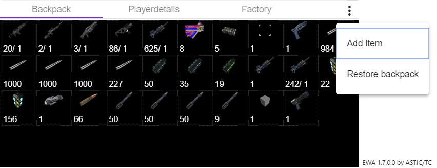

Hier wird das Inventar des ausgewählten Spielers angezeigt. Von hier aus kann man
* Items hinzufügen
* Einen alten Zustand des Backpacks wiederherstellen
* Items löschen

### Spielerdetails
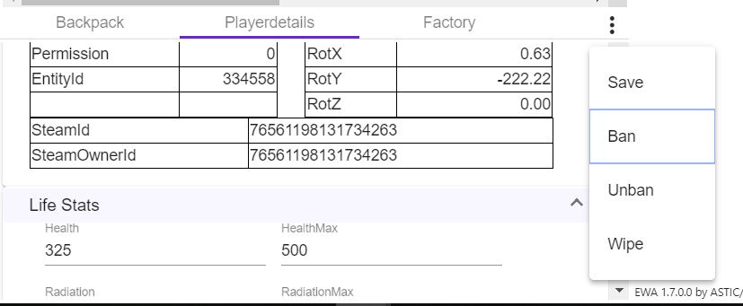

Hier werden die Daten des ausgewählten Spielers angezeigt und können geändert werden.
* ban/unban und wipe

### Fabrik
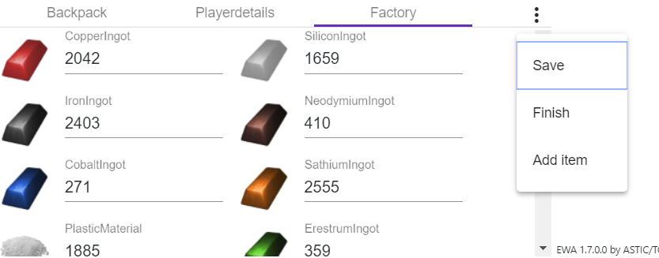
Hier können Items in die Fabrik des Spielers hinzugefügt, die Anzahl geändert oder der aktuelle Bauauftrag fertiggestellt werden.

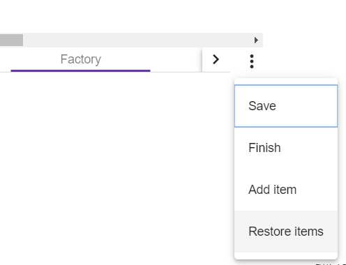
Hier können die Fabrikinhalte des Spielers über die Zeit eingesehen und widerhergestellt werden
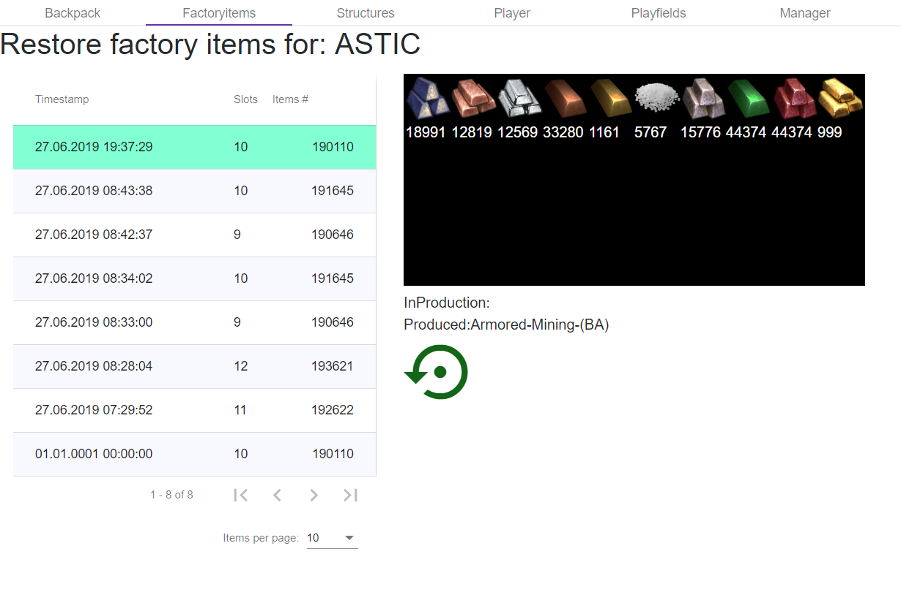

## Strukturen
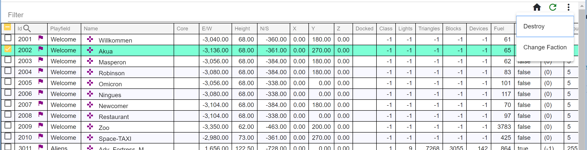

Hier werden alle Strukturen des Spiels aufgelistet:
* Sie können Teleportiert werden
* Die Position kann in den Speicher für ein Warp übertragen werden
* Die Strukturen können gelöscht werden
* Die Fraktion der Strukturen kann auf Adm, Aln oder die des ausgewählten Spielers gesetzt werden

## Playfield
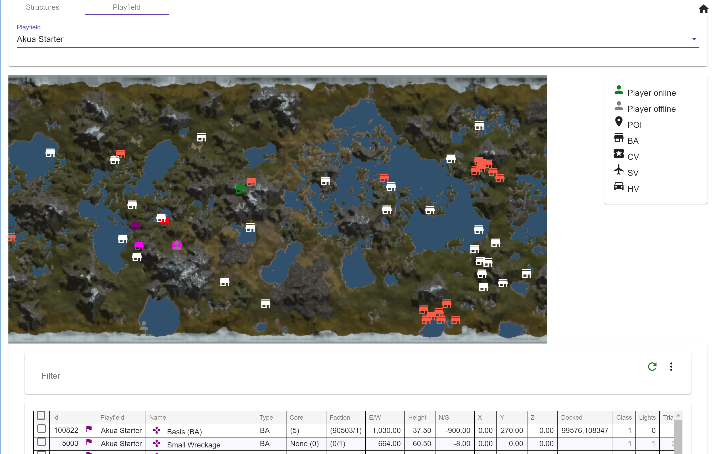

Playfieldansicht mit den Strukturen.
Hinweis: Um eine Karte des Playfields einblenden zu können muss diese map.png erst aus dem Cache eines Clients in das 
\\MODs\\EWA\\Maps\\\[Playfield\]\\map.png 
Verzeichnis kopiert werden

Das Playfield kann in einer 2D und einer 3D Ansicht angezeigt werden
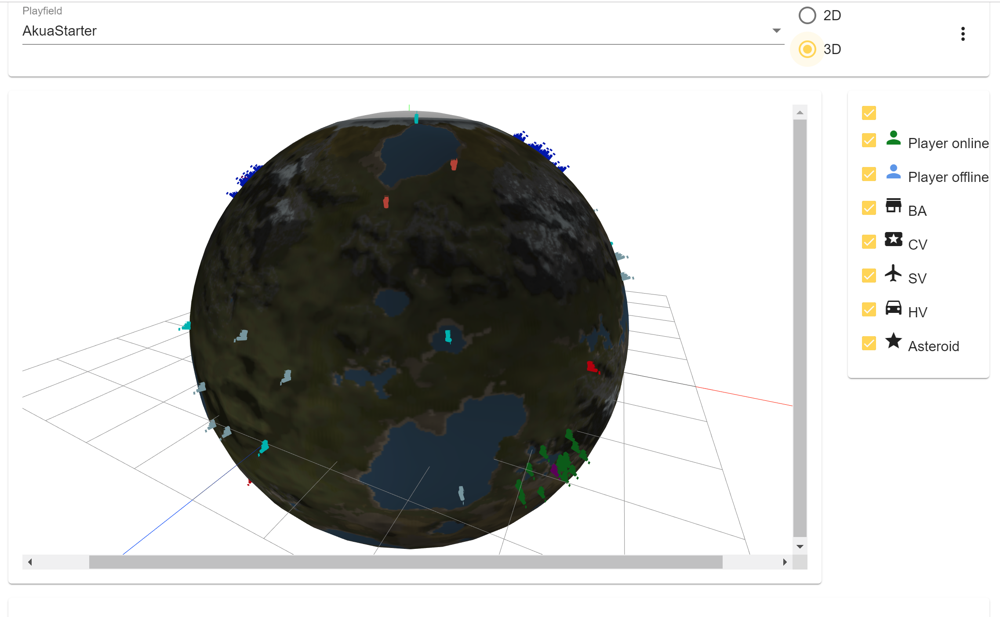
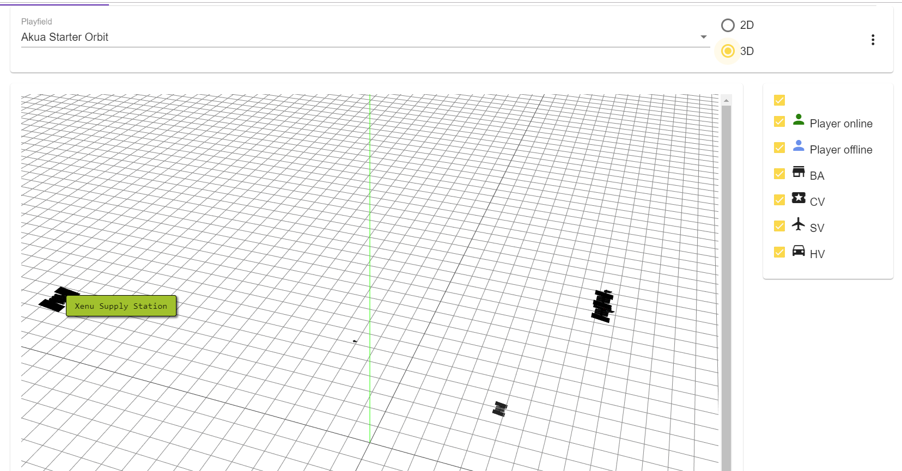

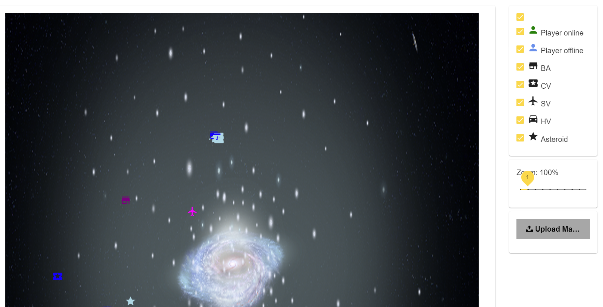
Hinweis: Bei der 2D Orbitalansicht wird das aktuelle Bild der http://hubblesite.org/ als Hintergrund eingeblendet angezeigt.

## History
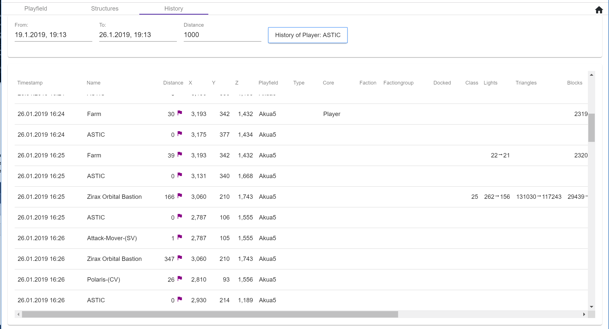

Hiermit kann man ermitteln was in dem ausgewählten Zeitraum und Abstand von dem gewählten Objekt (Spieler oder Struktur) passiert ist.

Die History der Stukturen wird in den Abständen ermittelt die in der "appsettings.json" mit
```
  "AppSettings": {
    "GlobalStructureUpdateInSeconds": 60
  },
```
eingestellt werden kann. (Standard ist 60 Sekunden)

## Restore
Wiederherstellung von Backpacks: 
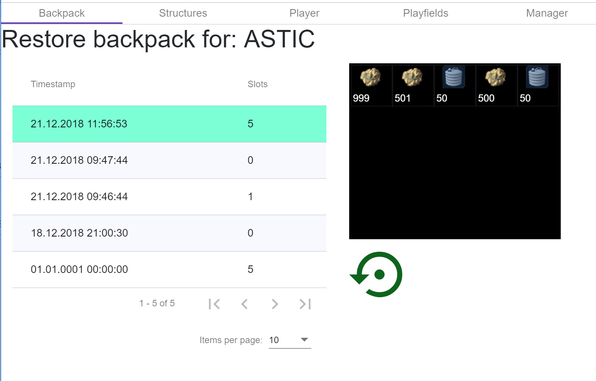

Strukturen:
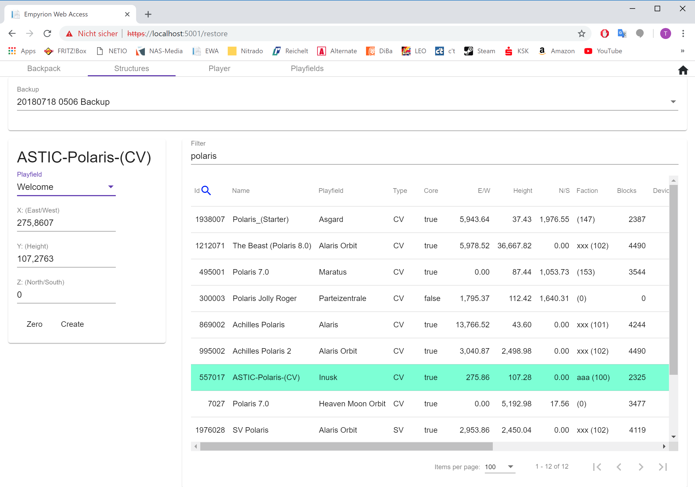

Gelösche/zerstörter Strukturen des aktuellen Savegames können wiederhergestellt werden in dem als Backup "### Current Savegame ###" ausgewählt wird

Spielerdateien:
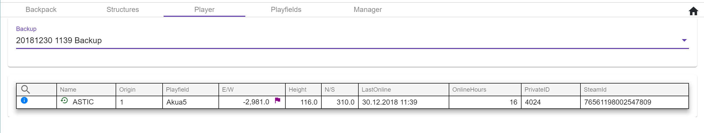

Playfields:


## Galaxy
Hier wird die Galaxiekarte mir den Warpverbindungen angezeigt und die Liste der Orbits und Planeten.
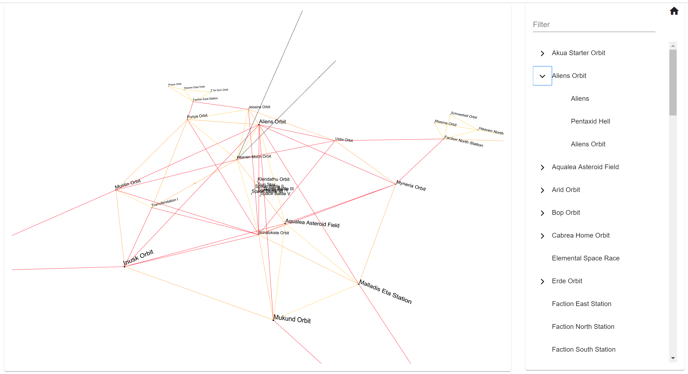

## Start/Stop
EmpyrionWebAccess startet nicht automatisch sondern es muss eine "start.txt" Datei im Verzeichnis \[Savegame\]\\MODs\\EWA liegen.
Fehlt diese Datei wird der EWA automatisch gestoppt bzw. gar nicht erst gestartet. 

## Server Settings
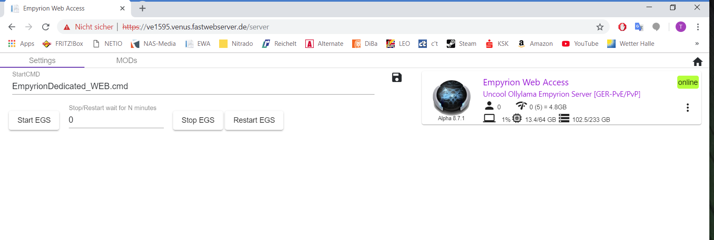

* Wilkommensnachricht für neue Spieler bei {0} wird der Name des neuen Spielers eingesetzt
* Startbatch für den EGS Server
* Start, Stop, Restart des EGS Servers mit einer wählbaren Vorwarnzeit
* EGS und EWA herunterfahren - Achtung: EGS muss danach über einen anderen Weg gestartet werden

## User and roles
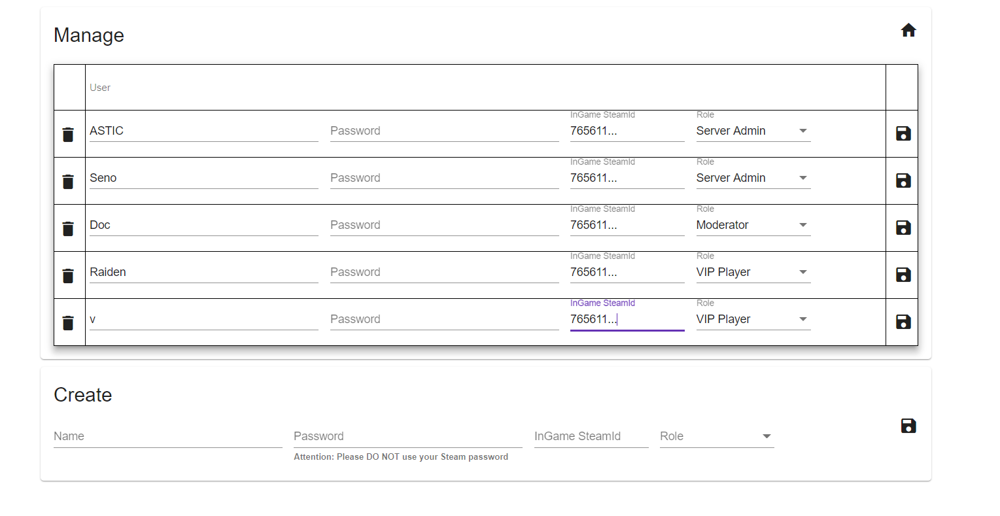

Hier können die Benutzer des EWA angelegt, geändert oder gelöscht werden. Außerdem kann ihnen hier eine Rolle zugewiesen werden.

Damit die Rollen VIP Player & Player korrekt funktionieren MÜSSEN hier die SteamIDs der Spieler eingetragen werden. Bei den anderen Rollen ist dies zur Zeit optional.

* Server Admin
* InGame Admin
* Moderator
* Game Master
* VIP Player
* Player

### Update EWA
Einfach die EWALoaderXYZ.zip Datei der neuen Version für ein Upload auswählen. Der Upload startet automatisch.
Je nachdem ob der EGS Server läuft wird zunächst das EWA und dann beim nächsten Stop des EGS der EWALoaderClient akualisiert
im anderen Fall wird erst der EWALoaderClient und beim Start des EGS Servers dann das EWA aktualisiert.

## Mod Manager
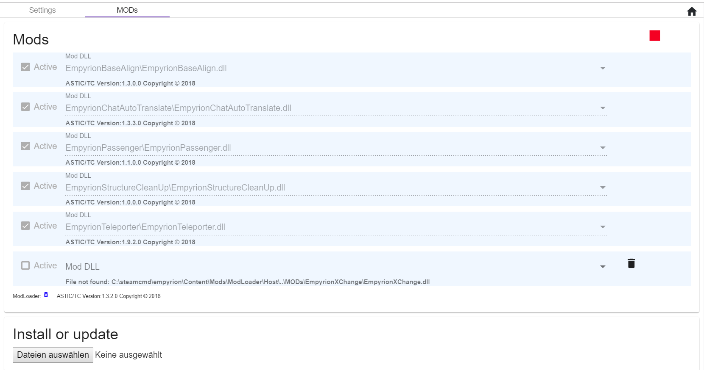

Zunächst muss der ModLoader installiert werden. Danach können die gewünschten Mods per Upload installiert werden.

* Der ModLoader kann bei Bedarf ebenfalls mit all seinen Mods deinstalliert werden.
* Falls notwendig kann der Modloader aus dem EWA Paket aktualisiert werden.

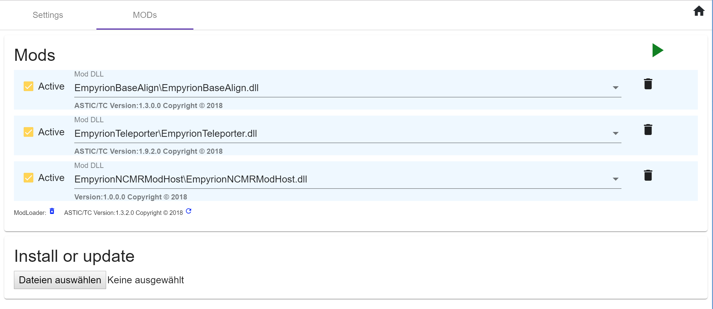

Hinweis: Um Änderungen an den Mods zu übernehmen muss der ModLoader gestoppt und erneut gestartet werden. 
In der Zwischenzeit sind alle installierten Mods des ModLoaders vom Spiel aus nicht erreichbar.

### Konfigurations von MODs
Mods können über eine Steuerdatei (ModAppConfig.json) den Pfad zu ihrer Konfiguration hinterlegen. Diese wird dann vom EWA zum Ändern (das Zahnradsymbol) angeboten.

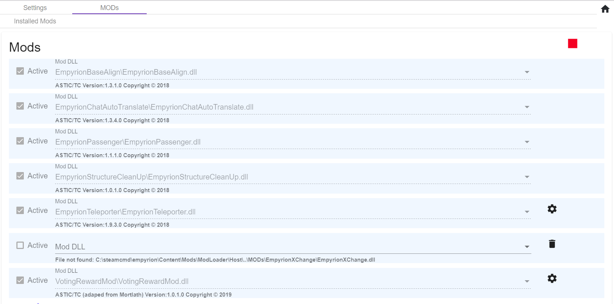

```
z.B.
[EGS]\Content\Mods\ModLoader\MODs\VotingRewardMod\ModAppConfig.json

{
  "ModConfigFile": "VotingReward/Configuration.json"
}
```

### Unterstützte MOD Dateien
* Eine einfache DLL
* Eine ZIP Datei mit den Dateien einer Mod und deren Unterverzeichnissen - ggf. muss hier noch die richtige DLL ausgewählt werden

## Timetable
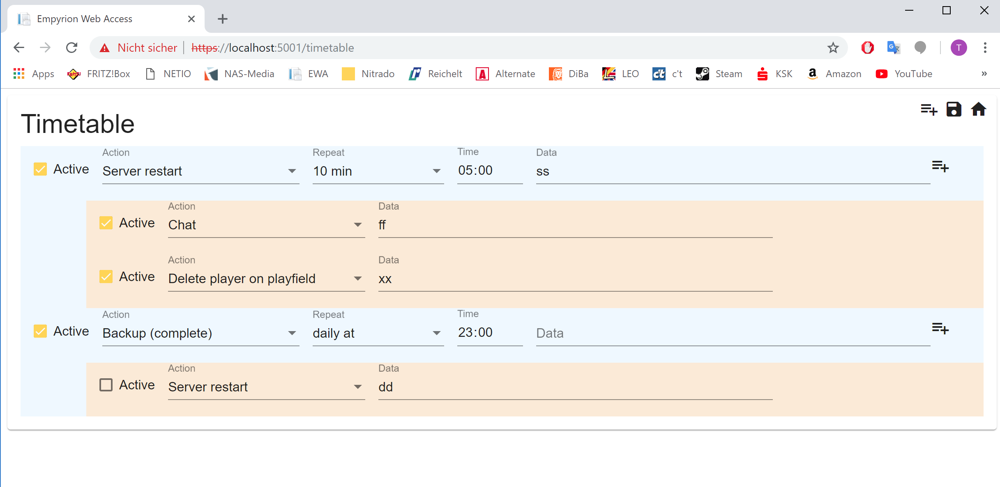

Mit der Timetable können zeitgesteuerte Aufgaben konfiguriert werden. Falls Aufgaben innerhalb einer anderen Aufgabe ablaufen sollen können diese als Unteraufgaben hinzugefügt werden.

## Positionen merken/warp
Die Positionen von Strukturen oder Spielern können sich 'gemerkt' werden in dem das Fahnensymbol angeklickt wird.

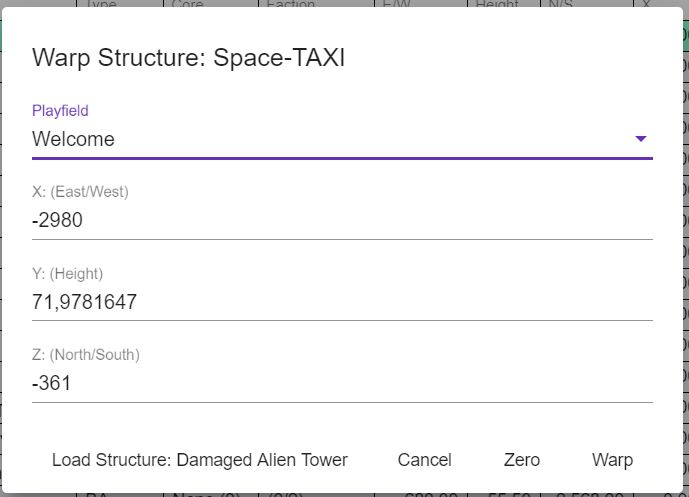

Ein Warpfenster kann über das Gamepadsymbol aufgerufen werden. Eine zuvor 'gemerkte' Position wird dann hier ebenfalls angeboten.

# Empyrion Steam Update Check
- Updatecheck with sub command e.g. Run Shell
  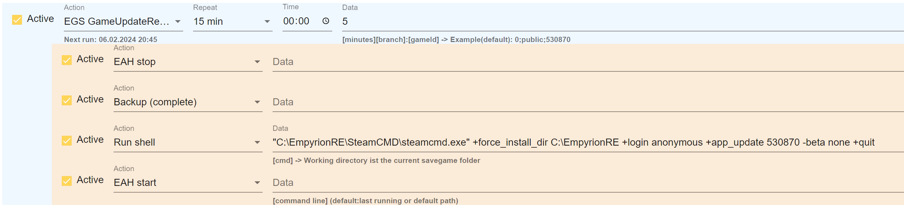
  "C:\steamcmd\SteamCMD\steamcmd.exe" +login anonymous +force_install_dir C:\steamcmd\empyrion.server +app_update 530870 -beta none +quit

# Erweiterte Konfiguration
## LetsEncrypt Service nutzen
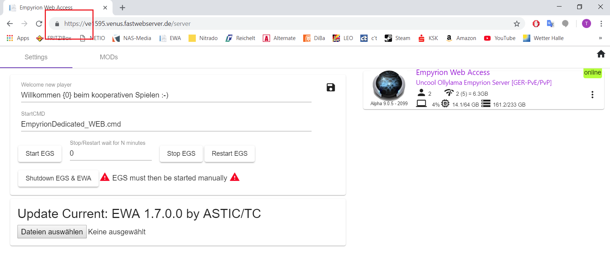

LetsEncrypt stellt eine kostenlose und freie Möglichkeit für vollständig gültige HTTPS Zertifikate
dar. Der Dienst benötigt keine Anmeldung oder Registrierung, sondern kann von 'Webservern' 
dynamisch nach einem Zertifikat gefragt werden. Dies geschieht, ebenso wir die Aktualisierung
desselben automatisch.
Zur Sicherheit kann man noch seine Email Adresse hinterlegen. Dann sendet LetsEncrypt vor Ablauf eines Zertifikates eine Benachrichtigungsemail.

In der 'appconfig.json' im \[Savegame\]\\MODs\\EWA folgenden Eintrag machen

```
  "LetsEncryptACME": {
    "UseLetsEncrypt": true,
    "DomainToUse": "{ComputerName}",  
    "EmailAddress": "email@example.com",
    "CountryName": "Country",
    "Locality": "language",
    "Organization": "your Organization",
    "OrganizationUnit": "your Organization Unit",
    "State": "state"
  },
```

Hinweis: LetEncrpyt funktioniert derzeit nur mit den Standard Ports 80 bzw 443.

## Erstellen eines eigenen selbst signierten Zertifikates für die HTTPS Verbindung
Der EWA enthält bereits ein selbst signiertes Zertifikat. Sie können jedoch auch ein eigenes mit der PowerShell anfertigen:

1. New-SelfSignedCertificate -certstorelocation cert:\localmachine\my -dnsname EmpyrionWebAccess -NotAfter (Get-Date).AddYears(10)
--> CE0976529B02DE058C9CB2C0E64AD79DAFB18CF4
1. $pwd = ConvertTo-SecureString -String "Pa$$w0rd" -Force -AsPlainText
Export-PfxCertificate -cert cert:\localMachine\my\CE0976529B02DE058C9CB2C0E64AD79DAFB18CF4 -FilePath EmpyrionWebAccess.pfx -Password $pwd
1. Nun muss die EmpyrionWebAccess.pfx Datei auf dem Server abgelegt werden und der Dateipfad und das Kennwort in der appsettings.json Datei im \[Savegame\]\\MODs\\EWA Verzeichnis eingetragen werden
4. In dem Abschnitt 
```
   "Kestrel": {   
        "Certificates": { 
            "Default": { 
                "Path": "\[vollständiger Name zu der PFX Datei\]",
                "Password": "\[das vergebene Passwort\]"
            }
        }
...
    }
```

## Freigabe von Ports
Ggf. müssen die Ports und Adressen noch für den Benutzer, unter dessen Account EGS läuft, freigegeben werden. Dazu muss man in einer Admin-PowerShell Console folgende Befehle absetzen.

1. Für HTTP
   * netsh http add urlacl url=http://[computername][:Port]/ user=[domain/computer]\[user]
   * netsh http add urlacl url=http://[IP-Adress][:Port]/ user=[domain/computer]\[user]
1. Für HTTPS
   * netsh http add urlacl url=https://[computername][:Port]/ user=[domain/computer]\[user]
   * netsh http add urlacl url=https://[IP-Adress][:Port]/ user=[domain/computer]\[user]


# Weitere Infos und den Quelltext gibt es hier
https://github.com/GitHub-TC/EmpyrionWebAccess

The internal plugins work with
Ist similiar to the original EmpyrionAPITools - only with async await and .NET 4.6<br>
https://github.com/GitHub-TC/EmpyrionNetAPIAccess

mod managing via<br>
https://github.com/GitHub-TC/EmpyrionModHost

# Was kommt noch?
* VirtualAutominer 
* ChatBot Hilfsbefehle
* ...
* was wir/ich sonst noch so brauchen :-)


-----------------------------------------------------------------------------
# English Version

# Empyrion Web Access

## What's this?
Empyrion Web Access is a MOD that allows access to the game as an admin via a web browser.
The fact that the MOD gets along without a surface or remote desktop on the server, it is also suitable for use with game host.
It starts and ends automatically with the game and can be used by any number of admins at the same time.

Empyrion Web Access is free for non-commercial use. <br>
About a Aufmersamkeit I would be happy but https://paypal.me/ASTICTC

Have fun playing and server operation wishes
ASTIC/TC

## installation
* Extract the Content of the ZIP file into the directory "\\Empyrion-Dedicated Server\\Content\\Mods"

* When start the Empyrion Dedicated Server the file "xstart.txt"will be created in the savegame directory \[Savegame\]\\Mods\\EWA. Where "Savegame" is your game savegame name.

* Shut down the Server and rename the "xstart.txt" to "start.txt". When the Server is restarted,
the Ewa-Loader should be ready for use.
* 

* !!! IMPORTANT !!! EmpyrionWebAccess does not start automatically. The "start.txt" file must always be located in the directory \[Savegame\]\\MODs\\EWA.
* If you want to switch off the EWA again it is enough to change the "start.txt" into "xstart.txt" again.


# Web server configuration
By default, the EWA can be reached at https://\[computer name\].

If this should happen on another port or url the text file "appsettings.json" must be in
Savegame directory can be configured under \[Savegame\]\\MODs\\EWA.
Several server URLs are suggested - under Http and HttpsDefaultCert only one entry "Url" may remain uncommented
other MUST be commented out by //.

Note: The web server runs exclusively via HTTPS and uses the HTTP only for forwarding to HTTPS.

## First login
When starting the EGS server, Empyrion Web Access should display a login mask under the selected ServerURL.

As the first user, the abbreviation and password are automatically stored and accepted in the user database. All users can be subsequently created, changed or deleted via the interface.

Note: Since the EWA's HTTPS certificate is self-signed, the browser displays a warning that the connection is not secure. This can be ignored here.
## The main window
### System/Game Information
Top right information about the server (CPU, RAM, HDD), the game (online players, number of Playfield servers, the reserve server and their memory consumption) and the version is displayed.
Also under the three right-most points is the menu for further windows and the logout.

### chat area
Here are all the chat messages of the game. The admin can also place chat messages in the game from here by entering the text in the "Message" input field and confirming with Enter/Return. If the check mark "Chat as NNNN" is set, an NNNN: is automatically set for the players in the game before the chat message.

To chat directly with a player, you can select it with the chat icon. Its name is then displayed below the input field. To be able to chat again with all players then simply the hook at "Chat to all" be set again.

### Active playfields and the players who are in it
Here the active playfields are listed with their name and number of players.
Players are shown with faction and name.

The chat symbol is used to make direct contact with the player and to save the flag symbol, its current position (see Warp).

If a chat text (directly or via timetable) starts with | it is evaluated as a translatable text from the Localization.csv. This can be modified with up to two parameters which are also separated with |.
e.g. |ChatTest|abc|42
and an entry in Localization.csv
ChatTest,"English text {0} {1}","Deutscher Text {0} {1}"

results for the language English: Engish text abc 42
and for German: Deutscher Text abc 42

### The list of known players
Here are all players displayed that were in the runtime of EWA times online and their PLY file is still in the savegame.

The player is shown here with his online status, name, faction, origin ...
* The chat symbol is used to make direct contact with the player and to save the flag symbol, its current position (see Warp).
* The warp icon (gamepad icon) is used to bring up the Warp window for the player to change the position of the player in the game.

### Inventory display
Here the inventory of the selected player is displayed. From here you can
* Add items
* Restore an old condition of the backpack

### Player details
Here, the data of the selected player is displayed and can be changed.
Note: Still open: ban / unban and wipe

## Structures
Here are all the structures of the game listed:
* They can be teleported
* The position can be transferred to the memory for a warp
* The structures can be deleted
* The faction faction can be set to Adm, Aln, or the selected player

## Playfield
Playfield view with the structures.
Note: In order to be able to show a map of the playfield, this map.png first has to be copied from the cache of a client into the
\\MODs\\EWA\\Maps\\\[Playfield\]\\map.png
Directory are copied

## History


With this you can determine what happened in the selected period and distance from the selected object (player or structure).

## Restore
Recovery of backpacks, structures, player files and playfields from backups


Structures:


The deleted / destroyed structures of the current savegame can be restored by selecting "### Current Savegame ###" as backup

Player files:


Playfields:


## Galaxy
Here the galaxy map is displayed with the warp links and the list of orbits and planets.


## Start/Stop
EmpyrionWebAccess does not start automatically there must be a "start.txt" file in the directory \[Savegame\]\\MODs\\EWA.
If this file is missing, the EWA is automatically stopped or not even started.

## Server Settings
* Welcome message for new players at {0} will use the name of the new player
* Startup batch for the EGS server
* Start, Stop, Restart the EGS server with a selectable early warning time
* Shut down EGS and EWA - Attention: EGS must then be started by another route

### Update EWA
Simply select the EWALoaderXYZ.zip file of the new version for upload. The upload starts automatically.
Depending on whether the EGS server is running, the EWA is first updated and then the EWALoaderClient is refreshed the next time the EGS is stopped
otherwise the EWALoaderClient will be updated first and then the EWA will be updated when the EGS server is started.

## Mod Manager
First, the ModLoader must be installed. Then the desired mods can be installed by upload.
Note: To apply changes to the mods, the ModLoader must be stopped and restarted.
In the meantime, all installed ModLoader mods are unreachable from the game.

* If necessary, the ModLoader can also be uninstalled with all its mods.
* If necessary, the modloader can be updated from the EWA package.

### Supported MOD files
* A simple dll
* A ZIP file with the files of a mod and their subdirectories - if necessary, the correct DLL must be selected here

# Advanced configuration
## Use LetsEncrypt service
LetsEncrypt provides a free and free way for fully valid HTTPS certificates
The service does not require login or registration but can be accessed by 'web servers'.
be dynamically asked for a certificate. This happens as well as we update
same automatically.
For security, you can still deposit his email address. LetsEncrypt then sends a notification email before the expiration of a certificate.

Make the following entry in 'appconfig.json' in \[savegame\]\\MODs\\EWA

```
  "LetsEncryptACME": {
    "UseLetsEncrypt": true,
    "DomainToUse": "{ComputerName}",
    "EmailAddress": "email@example.com",
    "CountryName": "Country",
    "Locality": "language",
    "Organization": "your Organization",
    "OrganizationUnit": "your Organization Unit",
    "State": "state"
  },
```

Note: LetEncrpyt currently only works with the stanadard ports 80 or 443.

# Advanced configuration
## Create your own self-signed certificate for the HTTPS connection
The EWA already contains a self-signed certificate. But you can also make your own with PowerShell:

1. New-SelfSignedCertificate -certstorelocation cert: \localmachine \my -dnsname EmpyrionWebAccess -NotAfter (get-date) .AddYears (10)
-> CE0976529B02DE058C9CB2C0E64AD79DAFB18CF4
1. $ pwd = ConvertTo-SecureString -String "Pa $$ w0rd" -Force -AsPlainText
Export-PfxCertificate -cert cert: \localMachine \my \CE0976529B02DE058C9CB2C0E64AD79DAFB18CF4 -FilePath EmpyrionWebAccess.pfx -Password $ pwd
1. Now the EmpyrionWebAccess.pfx file must be placed on the server and the file path and the password in the appsettings.json file in the \[Savegame\]\\MODs\\EWA directory must be entered

## Release of ports
Possibly. the ports and addresses must still be released for the user under whose EGS account is running. To do this, you need to issue the following commands in an Admin PowerShel Console.

1. For HTTP
   * netsh http add urlacl url = http://[computername] [: port]/user = [domain/computer]\[user]
   * netsh http add urlacl url = http://[ipaddress] [: port]/user = [domain/computer]\[user]
1. For HTTPS
   * netsh http add urlacl url = https://[computername] [: port]/user = [domain/computer]\[user]
   * netsh http add urlacl url = https://[ipaddress] [: port]/user = [domain/computer]\[user]


# Further information and the source code can be found here
https://github.com/GitHub-TC/EmpyrionWebAccess

The internal plugins work with
Is similiar to the original EmpyrionAPITools - only with async await and .NET 4.6 <br>
https://github.com/GitHub-TC/EmpyrionNetAPIAccess

mod managing via <br>
https://github.com/GitHub-TC/EmpyrionModHost

# What else is coming?
* VirtualAutominer 
* ChatBot supportcommands
* ...
* what else do we need :-)